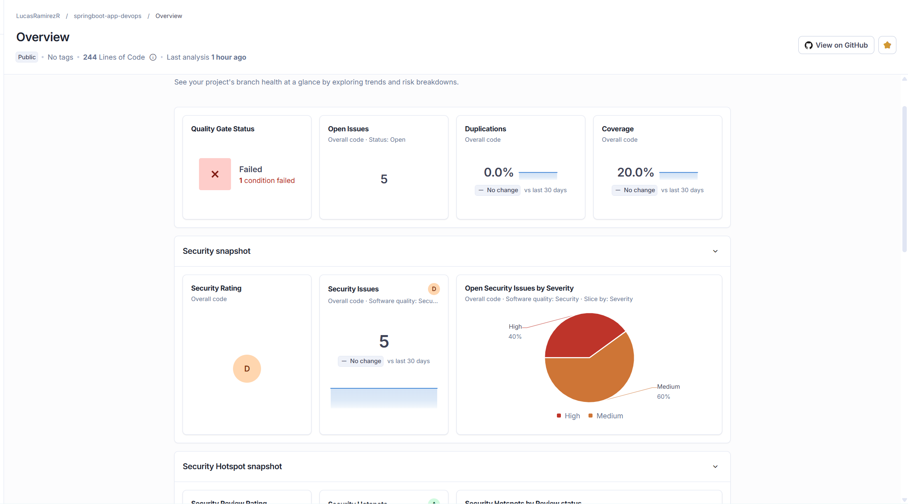
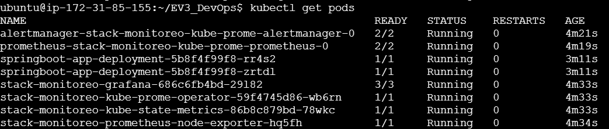
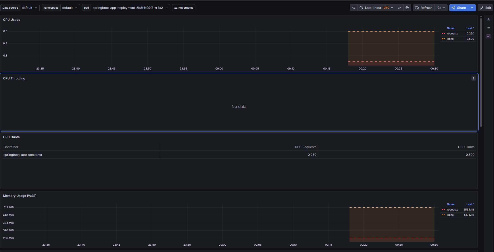

# Evaluación 3 - DevOps: Taller de Integración Continua y Despliegue 

Este repositorio contiene la arquitectura completa de CI/CD, infraestructura como código y observabilidad para un microservicio desarrollado en **Spring Boot**. El objetivo de este proyecto es demostrar la automatización del ciclo de vida del software, desde la integración de código hasta su monitoreo en un entorno de producción simulado en la nube.

---

##  1. Arquitectura del Proyecto
El proyecto se estructura bajo un pipeline de entrega continua que conecta las siguientes tecnologías:
* **Control de Versiones:** GitHub
* **CI/CD:** GitHub Actions
* **Análisis de Calidad Estática:** SonarCloud / SonarQube
* **Contenerización y Registro:** Docker & Docker Hub
* **Orquestación y Nube:** Kubernetes (Minikube) sobre una instancia AWS EC2 (t3.medium)
* **Observabilidad:** Helm, Prometheus y Grafana

---

##  2. Pipeline CI/CD Funcional
Se implementó un flujo de trabajo automatizado mediante GitHub Actions (`.github/workflows/pipeline.yml`). Cada vez que se realiza un *push* a la rama principal, el pipeline ejecuta de forma secuencial:
1. Configuración del entorno Java 21.
2. Compilación y testing con Maven.
3. Escaneo de calidad y seguridad con SonarQube.
4. Construcción de la imagen Docker.
5. Push al registro público de Docker Hub (`latest`).


---

##  3. Integración de SonarQube y Detención Automática
Se integró **SonarCloud** para evaluar el cumplimiento de políticas de calidad, cobertura y seguridad (IE5). 

El pipeline está diseñado bajo una **política de tolerancia cero a fallas críticas (IE6)**. Como se demuestra en la siguiente evidencia, cuando SonarQube detecta vulnerabilidades que reprueban el *Quality Gate* (Status: Failed), el pipeline de GitHub Actions arroja un error y **se detiene automáticamente**. Esto bloquea el proceso de empaquetado en Docker, garantizando que el código defectuoso jamás llegue al entorno de AWS.




---

##  4. Despliegue en Kubernetes
El microservicio contenerizado se despliega en un clúster de Kubernetes alojado en una instancia EC2 de AWS. 
Se configuraron manifiestos YAML (`k8s/deployment.yaml` y `k8s/service.yaml`) para definir:
* **Alta disponibilidad:** 2 réplicas exactas del pod corriendo simultáneamente.
* **Gestión de recursos:** Cuotas estrictas de CPU y Memoria (Limits y Requests) para evitar la saturación del servidor.

A continuación, se evidencia el estado operativo (`Running`) de los Pods dentro del servidor AWS:



---

##  5. Observabilidad: Prometheus, Grafana y Dashboards 
Para asegurar el monitoreo continuo, el stack de observabilidad no se configuró mediante manifiestos estáticos individuales, sino que se implementó de forma dinámica directamente en el clúster utilizando el gestor de paquetes **Helm**:



```bash
# Comandos utilizados para la configuración del monitoreo
helm repo add prometheus-community [https://prometheus-community.github.io/helm-charts](https://prometheus-community.github.io/helm-charts)
helm install stack-monitoreo prometheus-community/kube-prometheus-stack --timeout 15m